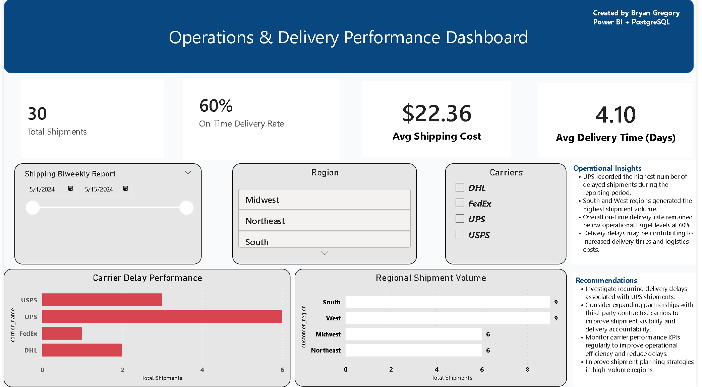

Markdown
# Operations & Delivery Performance Dashboard

📌 Project Overview
This project analyzes logistics and shipment operations using PostgreSQL and Power BI. The dashboard tracks shipment volume, carrier delays, delivery performance, and shipping costs to identify operational inefficiencies and support business decision-making.

🛠 Tools Used
- PostgreSQL
- SQL
- Power BI
- Data Modeling
- KPI Reporting
- Data Visualization

## Dashboard Preview 

📊 Key KPIs
- Total Shipments
- On-Time Delivery Rate
- Average Shipping Cost
- Average Delivery Time
- Carrier Delay Performance
- Regional Shipment Volume

🔍 Operational Insights
- UPS recorded the highest number of delayed shipments.
- South and West regions generated the highest shipment volume.
- Overall on-time delivery rate remained below operational target levels at 60%.
- Delivery delays may contribute to increased delivery times and logistics costs.

✅ Recommendations
- Investigate recurring delivery delays associated with UPS shipments.
- Consider expanding partnerships with third-party contracted carriers to improve shipment visibility and accountability.
- Monitor carrier KPIs regularly to improve operational efficiency.

🗄 Database Structure

Tables Included:
- shipments
- carriers
- warehouses
- products_summary

## SQL Analysis Performed

- Carrier performance analysis
- Warehouse effiency reporting
- On-time delivery KPI calculations
- Regional shipping cost analysis
- Revenue by product category
- Shipment status reporting

- ## What I Learned
  Through this project, I strengthened my understanding of SQL joins, KPI reporting, operational analytics, Power BI dashboard development, and translating logistics data into actionable business insights.

